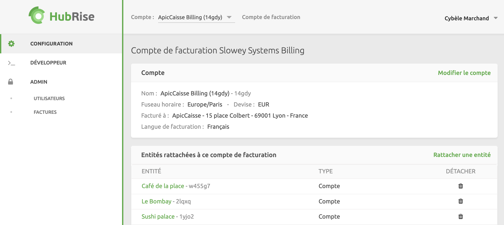

En tant que fournisseur de logiciels, revendeur ou consultant, vous pourriez choisir de prendre en charge l'abonnement HubRise de vos clients pour diverses raisons. Cela pourrait être pour inclure l'offre HubRise sous forme de service en marque blanche, pour tenir compte de la préférence de votre client pour un service tout-en-un sans factures de tiers, ou encore pour bénéficier de remises sur volume pour les abonnements HubRise.

Pour ce faire, vous pouvez facilement inclure vos données de paiement dans le compte de votre client. HubRise vous enverra alors des factures mensuelles séparées pour chaque compte. Si vous avez de nombreux comptes sur HubRise, vous ne bénéficierez pas de remises sur volume.

Une meilleure alternative est de demander à HubRise de mettre en place un compte de facturation pour votre organisation. Ce compte est spécialement conçu pour gérer les abonnements de plusieurs comptes et points de vente. Les factures générées pour les comptes ou les points de ventes attachés sont regroupées en une seule facture mensuelle, permettant des remises sur le volume.

Les utilisateurs disposant d'un compte de facturation peuvent gérer de manière autonome leurs informations de facturation, ajouter une méthode de paiement et attacher ou détacher des comptes et des points de vente.

Dans les sections suivantes, **entité** fera référence à un compte ou à un point de vente.

## Attacher des entités

Vous allez le plus souvent attacher des comptes, sauf si vous avez une raison spécifique d'attacher un point de vente.

Pour attacher une entité à votre compte de facturation, suivez ces étapes :

1. Connectez-vous à votre [compte HubRise](https://manager.hubrise.com).
2. Sélectionnez votre compte de facturation HubRise. Ce compte aura le nom de votre entreprise suivi de **Billing**.
3. Naviguez vers la page **CONFIGURATION**.
4. Cliquez sur **Attacher une entité**.
5. Choisissez **Attacher un compte** ou **Attacher un point de vente** en fonction de vos besoins.
6. Trouvez l'entité à attacher grâce au menu déroulant **Sélectionner**. Cette liste affichera uniquement les comptes et les points de vente auxquels vous avez accès, et qui ne sont pas déjà attachés.
7. Cliquez sur **Attacher**.
8. Répétez cette tâche autant de fois que nécessaire.
9. Retournez à votre page de **CONFIGURATION** et vérifiez que toutes les entités que vous avez attachées sont visibles dans la section **Entités rattachées à ce compte de facturation**.

***

**REMARQUE IMPORTANTE** : Lorsque vous attachez une entité, toutes les demandes de paiement en attente pour cette entité seront transférées sur votre compte de facturation.

***

## Détacher des entités

Lorsque vous détachez une entité de votre compte de facturation, elle sera facturée séparément et vous ne recevrez plus de factures pour cette entité.

Pour détacher une entité de votre compte de facturation, suivez ces étapes :

1. Connectez-vous à votre [compte HubRise](https://manager.hubrise.com).
2. Sélectionnez votre compte de facturation HubRise. Ce compte aura le nom de votre entreprise suivi de **Billing**.
3. Rendez-vous sur la page **CONFIGURATION**.
4. Section **Entités attachées à ce compte de facturation**, cliquez sur l'icône de la corbeille située sur le côté droit pour détacher les entités.

***

**REMARQUE IMPORTANTE** : Lorsque vous détachez une entité, toutes les demandes de paiement déjà émises pour cette entité resteront sur votre compte de facturation.

***

## Mettre à jour les informations de facturation

Les informations de facturation de votre compte de facturation sont utilisées pour générer des factures.

Pour configurer ces informations, suivez ces étapes :

1. Connectez-vous à votre [compte HubRise](https://manager.hubrise.com).
2. Sélectionnez votre compte de facturation HubRise. Ce compte aura le nom de votre entreprise suivi de **Billing**.
3. Rendez-vous sur la page **CONFIGURATION**.
4. Sélectionnez **Modifier compte**.
5. Renseignez les informations requises dans la section **Coordonnées de facturation**.
6. Cliquez sur **Mettre à jour**.

Pour plus d'informations, consultez la section [Mettre à jour les informations de facturation](/docs/payment#update-billing-information) de la page de paiement.

## Ajouter une méthode de paiement

La méthode de paiement enregistrée dans votre compte de facturation est utilisée pour payer les factures générées pour les entités attachées.

Pour ajouter une méthode de paiement à votre compte de facturation, suivez ces étapes :

1. Connectez-vous à votre [compte HubRise](https://manager.hubrise.com).
2. Sélectionnez votre compte de facturation HubRise. Ce compte aura le nom de votre entreprise suivi de **Billing**.
3. Rendez-vous sur la page **CONFIGURATION**.
4. Cliquez sur **Ajouter une méthode de paiement** et saisissez les informations de votre carte de paiement. Les cartes de crédit doivent être valides pour être acceptées.
5. Une fois que vous avez terminé, cliquez sur **Enregistrer**.

Pour plus d'informations, voir la rubrique [Ajouter une méthode de paiement](/docs/payment#add-payment-method).
