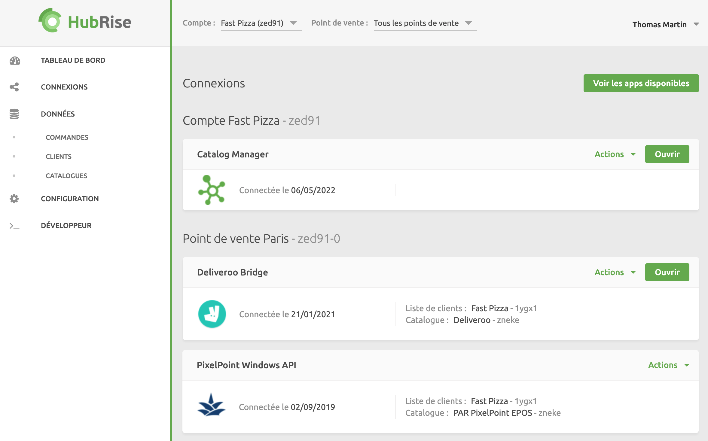
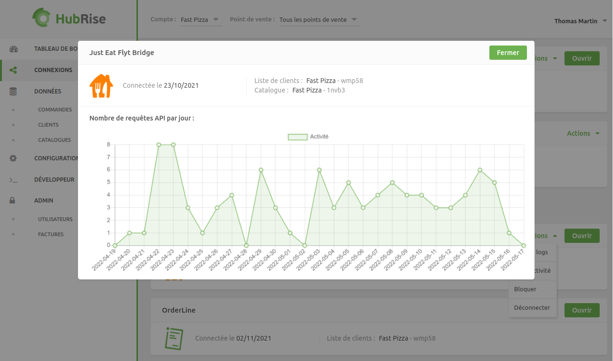
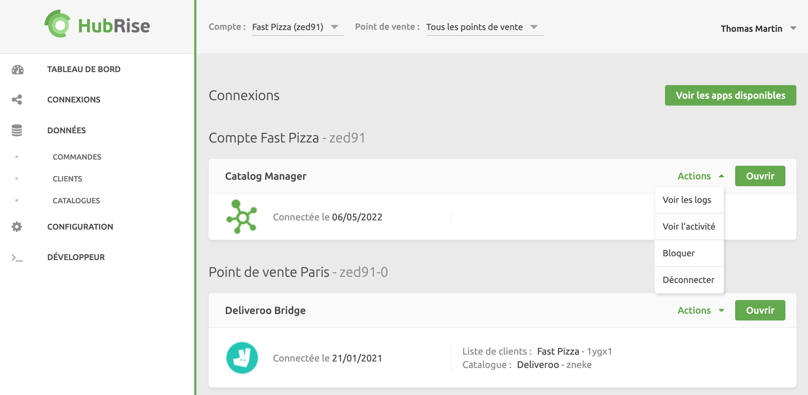

Vous pouvez connecter de nouvelles applications et visualiser les applications connectées à votre compte HubRise depuis la page **CONNEXIONS**. Cette page vous permet également d'afficher l'activité et les logs des applications, ou de bloquer et déconnecter des applications.

## Applications disponibles

HubRise vous permet de connecter un écosystème de solutions en constante évolution : logiciels de caisse, plateformes de livraison de repas (dont Deliveroo, Uber Eats et Just Eat), solutions de gestion de livreurs ou de services de livraison, solutions d'e-marketing (SMS/e-mailing) et de business intelligence, systèmes de gestion de stock et de fidélisation client, et bien d'autres encore. Le nombre d'applications compatibles augmente chaque mois.

Vous pouvez connecter toutes les applications disponibles sur la page [Apps](/apps) de HubRise. Si une application que vous souhaitez connecter n'apparaît pas sur cette page, vous pouvez contacter contact@hubrise.com pour savoir si une intégration est prévue.

## Connecter une application(#connect)

Les applications sont connectées soit à un compte HubRise, soit à un point de vente. Le niveau de connexion dépend des données que vous devez partager avec l'application : par exemple, les logiciels de caisse ou de commande en ligne se connectent généralement aux points de vente, tandis que les solutions de marketing se connectent indifféremment aux comptes ou aux points de vente.

Certaines applications sont connectables directement depuis le back-office de HubRise, tandis que d'autres exigent une configuration depuis l'application avant l'établissement de la connexion. Pour plus de détails, veuillez consulter la documentation de l'application sur la page [Apps](/apps) de HubRise.

Pour connecter une nouvelle application à votre compte HubRise à partir du back-office de HubRise, procédez comme suit :

1. Connectez-vous à HubRise à partir de la [page de connexion à HubRise](https://manager.hubrise.com/login?locale=fr-FR).
1. Cliquez sur **CONNEXIONS** dans la barre de navigation de gauche.
1. Sélectionnez **Voir les apps disponibles**.
1. Sélectionnez **Tous les points de vente**, ou sélectionnez le **point de vente** à connecter.
1. Sélectionnez l'application que vous souhaitez installer. Si l'application ne figure pas dans cette liste, consultez la documentation relative à l'application sur la page [Apps](/apps) de HubRise.
1. Consultez les instructions relatives à l'application spécifique et cliquez sur **Connecter**. Lors de l'installation d'une nouvelle application, il vous sera demandé d'octroyer à l'application l'accès à votre compte HubRise.

Certaines applications doivent être connectées au niveau de **tous les points de vente**, tandis que d'autres se connectent à un point de vente spécifique. Si vous n'avez pas sélectionné le niveau correspondant, le bouton **Connecter** apparaîtra grisé.

---

**REMARQUE IMPORTANTE** : si vous devez connecter plusieurs fois de la même application à un point de vente HubRise unique, consultez la section [Comment connecter plusieurs fois la même application ?](/docs/faqs/connect-multiple-instances-same-app)

---

## Ouvrir une application

Certaines applications sont accessibles depuis HubRise. Si tel est le cas, vous pouvez ouvrir l'application en cliquant sur **CONNEXIONS** et en sélectionnant **Ouvrir** pour l'application en question. Celle-ci s'ouvrira alors dans une nouvelle fenêtre de votre navigateur.

## Afficher l'activité de connexion(#connection-activity)

Pour afficher un graphique montrant le nombre de transactions enregistrées au cours des 30 derniers jours, sélectionnez **CONNEXIONS** > **Actions** > **Afficher l'activité**. C'est un moyen pratique de vérifier si des transactions transitent via la connexion.

---

**FAQ associée** : [Comment vérifier que la connexion entre mon système et HubRise fonctionne correctement ?](/docs/faqs/check-connection-between-my-system-and-hubrise)

---

## Afficher les logs de connexion(#connection-logs)

Chaque application connectée génère des logs, qui sont enregistrés. Vous pouvez utiliser ces logs pour analyser les communications entre les systèmes et déterminer la cause des incidents éventuels.

Pour afficher les logs relatifs à une connexion, sélectionnez **CONNEXIONS** > **Actions** > **Voir les logs** pour l'application en question.

Les logs enregistrent les requêtes de connexion adressées à HubRise par une application. Chaque requête constitue une transaction entre une application et HubRise, telle qu'une commande, l'enregistrement d'un nouveau client ou toute autre communication entre une application et HubRise.

### Informations générales

En haut de la page **Logs de connexion** figurent des informations générales relatives à la connexion :

- **Jeton d'accès** : jeton utilisé par l'application pour s'authentifier sur HubRise.
- **Portée** : permissions de connexion, par exemple le fait que la connexion accède au compte ou à un point de vente unique, l'accès en lecture/écriture défini sur les données, etc.
- **Liste de clients** et **Catalogue** : selon la portée, des lignes supplémentaires peuvent indiquer l'identifiant des ressources auxquelles l'accès a été octroyé, telles que la liste de clients ou le catalogue.

### Filtre

Les logs peuvent être filtrés par ressource et par méthode en procédant comme suit :

1. Sélectionnez **Éditer**.
1. Sélectionnez les ressources et les méthodes que vous souhaitez afficher. Pour afficher tous les enregistrements disponibles dans les logs, désélectionnez l'ensemble des ressources et des méthodes, ou cliquez sur **Réinitialiser**.

### Les logs

La page des logs affiche la liste des requêtes par ordre chronologique inverse, les plus récents apparaissant en premier.

Chaque entrée comprend les informations suivantes :

- **HEURE (UTC+02:00)** : date et heure de la requête.
- **RESSOURCE** : cible de la requête.
- **MÉTHODE** : méthode HTTP utilisée pour communiquer la requête.
- **URL** : adresse URL d'accès à la requête.
- **RÉPONSE** : code de réponse HTTP.

Vous pouvez afficher des détails supplémentaires en cliquant sur un log, notamment le contenu de la requête et de la réponse correspondante. Pour télécharger le contenu de la requête ou de la réponse, sélectionnez l'icône de téléchargement. <InlineImage width="15" height="14"></InlineImage>. La requête ou la réponse sélectionnée sera délivrée sous forme de fichier JSON.

Pour plus d'informations, voir la rubrique [Comprendre les logs HubRise](/docs/hubrise-logs/overview). Pour une référence complète sur l'API HubRise, voir la [page de référence de l'API HubRise](/developers/api/general-concepts) (en anglais).

---

**FAQ associée** : [Comment vérifier que la connexion entre mon système et HubRise fonctionne correctement ?](/docs/faqs/check-connection-between-my-system-and-hubrise)

---

## Bloquer ou déconnecter une application(#block-or-disconnect)

HubRise permet de bloquer ou déconnecter les applications :

- **Bloquer** une application l'empêche temporairement d'accéder à l'API de HubRise. Vous pouvez débloquer l'application à tout moment afin de rétablir l'accès.

- **Déconnecter** une application supprime la connexion entre celle-ci et HubRise. L'application est informée de la déconnexion, ce qui peut entraîner la réinitialisation ou la suppression de votre compte dans l'application.

---

**REMARQUE IMPORTANTE** : si vous êtes susceptible de réutiliser l'application, il convient de la bloquer plutôt que de la déconnecter.

---

Pour bloquer ou déconnecter une application dans HubRise, procédez comme suit :

1. Rendez-vous dans **CONNEXIONS**.
2. Recherchez l'application souhaitée, puis cliquez sur **Actions** > **Bloquer** ou **Déconnecter**.
3. Cliquez sur **Confirmer**.

