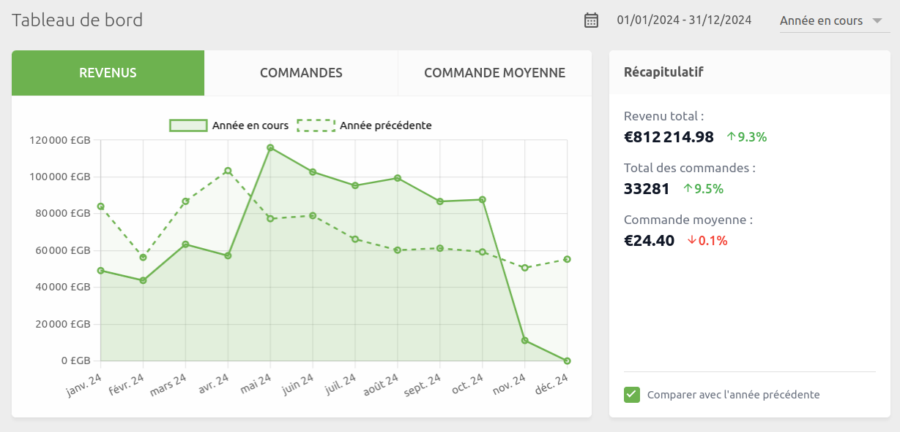
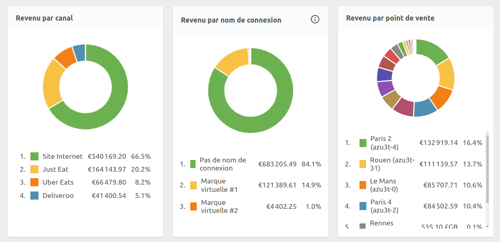
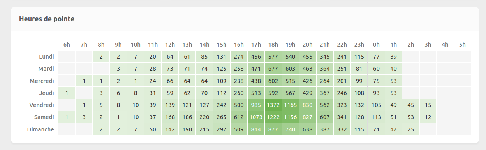
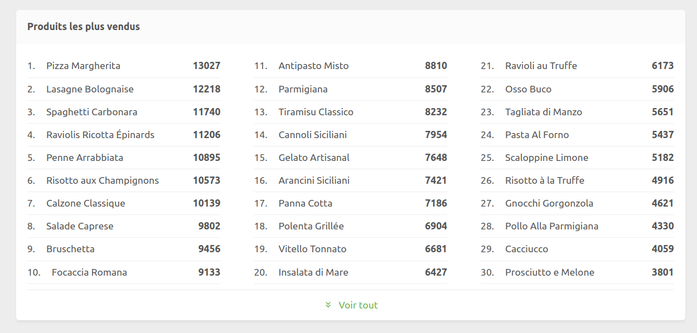

Le tableau de bord offre une vue complète de votre performance à travers une interface intuitive qui affiche vos tendances de revenus, la répartition par canaux de vente, les heures de pointe et les produits les plus vendus.

## Présentation de l'interface

Vous pouvez accéder au tableau de bord depuis le back office HubRise en cliquant sur **Tableau de bord** dans le menu de gauche.

Utilisez le menu déroulant dans la barre supérieure pour filtrer les données par point de vente, et sélectionnez la période à l'aide du sélecteur de dates en haut à droite du tableau de bord.

## Revenus et tendances

La courbe graphique montre l'évolution de vos revenus, avec une granularité ajustée en fonction de la période sélectionnée. Vous pouvez activer la comparaison avec la période précédente en cliquant sur **Comparer avec (...)**.

La section Résumé affiche vos indicateurs de performance :

- Revenu total
- Nombre de ventes
- Panier moyen

Lorsque la comparaison est activée, chaque métrique affiche son évolution par rapport à la période précédente. La période précédente est ajustée pour avoir la même durée que la période sélectionnée et donner une comparaison équitable.

## Répartition des revenus

Trois graphiques montrent la provenance vos revenus :

- Par canal de vente (site web, plateformes de livraison)
- Par nom de connexion (pour les marques virtuelles)
- Par point de vente

Cette vue multidimensionnelle vous aide à comprendre la contribution de chaque source de revenus.

## Analyse des heures de pointe

La table des heures de pointe affiche votre volume de ventes par jour de la semaine et par heure. Cela vous aide à identifier vos périodes les plus chargées pour optimiser vos plannings d'équipe, vos promotions et vos approvisionnements.

## Produits les plus vendus

Le classement affiche vos 30 articles les plus vendus. Cliquez sur **Voir tout** pour afficher la liste complète. Comme pour les autres vues, vous pouvez filtrer ces données par point de vente et par période.

## Rapports avancés

Pour une analyse plus détaillée de vos données, connectez une solution spécialisée intégrée à HubRise ou intégrez votre propre solution. Des partenaires techniques proposant des rapports détaillés sont accessibles via la page Apps du site HubRise, dans la section [Opérations et inventaire](/apps#operations-and-inventory).
