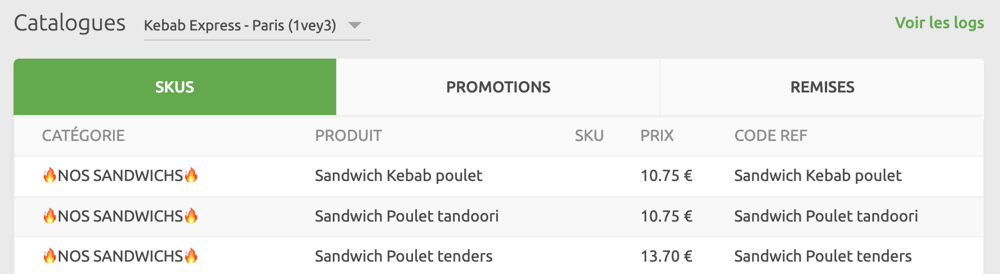

La section Données fournit des informations sur les commandes, les clients et les catalogues. Vous pouvez à tout moment sélectionner le compte et les points de vente à afficher.

## Commandes {#orders}

La page **COMMANDES** affiche les commandes dans l'ordre inverse de leur date de création. Pour chaque commande de la liste, vous pouvez voir les attributs suivants  :

- **DATE (UTC+02:00)** : la date, l'heure et l'identifiant unique de la commande.
- **POINT DE VENTE** : si vous sélectionnez l'option **Tous les points de vente**, cette colonne indique le point de vente qui a réceptionné la commande.
- **CLIENT** : client qui a passé la commande.
- **MONTANT** : montant total de la commande.
- **STATUT** : statut actuel de la commande. Pour une liste des statuts possibles, voir la section [Statut de la commande](/developers/api/orders#status) (en anglais) de la page **Order Management** (Gestion des commandes) de l'API HubRise.
- **ORIGINE** : application à partir de laquelle la commande a été générée.

Pour filtrer les commandes par dates de début et de fin, procédez comme suit :

1. Sélectionnez les champs **Du** et **Au** et définissez les plages de dates à filtrer.
1. Sélectionnez l'icône de recherche <InlineImage width="17" height="17"></InlineImage> pour filtrer les enregistrements d'après ces dates.
1. Pour effacer les filtres de date, supprimez les dates contenues dans les champs **Du** et **Au**, puis sélectionnez l'icône de recherche <InlineImage width="17" height="17"></InlineImage>.

Cliquez sur la date de la commande pour afficher les détails complets. Pour afficher les détails complets de la requête, cliquez sur la date et l'heure dans la section **Logs**. Pour plus d'informations, voir [Logs](/docs/data#logs).

---

**FAQ associée** : [Comment vérifier que la connexion entre mon système et HubRise fonctionne correctement ?](/docs/faqs/check-connection-between-my-system-and-hubrise)

---

## Clients {#customers}

La page **CLIENTS** affiche les listes de clients définies pour le compte sélectionné. Les clients sont classés par ordre inverse de leur date de création.

Les enregistrements contenus sur cette page affichent les attributs suivants :

- **NOM** : nom du client, suivi de son identifiant unique.
- **COMMANDES** : nombre de commandes passées par le client depuis son inscription.
- **DÉPENSE** : montant dépensé par le client sur l'ensemble des commandes passées avec le compte.
- **DEPUIS** : date de la première commande du client.

Pour filtrer les clients par nom ou adresse e-mail, procédez comme suit :

1. S'il existe plusieurs listes de clients associées au compte ou au point de vente, sélectionnez la liste déroulante en regard de l'intitulé **Clients**, puis sélectionnez la liste de clients à afficher.
1. Cliquez sur le champ **Rechercher par nom ou email** et saisissez le texte à rechercher.
1. Sélectionnez l'icône de recherche pour filtrer les enregistrements de client.
1. Pour revenir à la liste clients complète et non filtrée, supprimez tout le texte contenu dans le champ **Rechercher par nom ou email**, puis sélectionnez l'icône de recherche <InlineImage width="17" height="17"></InlineImage>.

Pour afficher les détails complets d'un client, cliquez sur le nom de celui-ci. Pour voir les logs complets de toutes les requêtes liées à la liste de clients, cliquez sur **Voir les logs**.

Pour créer, modifier ou supprimer une liste de clients, voir [Listes de clients](/docs/customer-lists).

## Catalogues {#catalogs}

À partir de la page **CATALOGUES**, vous pouvez afficher les catalogues présents dans HubRise et les logs des requêtes liées à chacun des catalogues.

Les applications connectées qui ont accès à votre catalogue HubRise peuvent télécharger ou modifier les catalogues. Un logiciel de caisse connecté peut par exemple pousser son catalogue de produits dans HubRise pour qu'un site internet d'e-commerce puisse l'utiliser. Si nécessaire, vous pouvez aussi éditer le catalogue dans **Catalog Manager**, une application gratuite disponible sur HubRise. Pour plus d'informations, voir [Catalogue](/apps/catalog-manager/overview).

### Afficher le catalogue {#view-catalog}

Les comptes et les points de vente peuvent contenir plusieurs catalogues. Pour afficher un catalogue spécifique, sélectionnez-le dans la liste déroulante en regard de l'intitulé **Catalogues**.

Les catalogues sont présentés dans trois onglets :

- **SKUS** : articles que vous vendez aux clients.
- **PROMOTIONS** : offres spéciales disponibles dans le catalogue. Les promotions s'appliquent non pas à des produits spécifiques, mais à l'ensemble de la commande. Cela pourrait être une formule avec trois services (entrée, plat principal et dessert) et des offres telles que **Un acheté - Un offert**.
- **REMISES** : rabais disponibles dans le catalogue. Les remise s'appliquent non pas à des produits spécifiques, mais à l'ensemble de la commande. Le code **LIVRAISON-OFFERTE**, par exemple, peut supprimer les frais de livraison pour l'ensemble de la commande, tandis que le code **C'EST-VENDREDI** peut offrir une remise de 10 % sur l'ensemble de la commande le vendredi.

Pour les SKUs, les attributs suivants s'affichent :

- **CATÉGORIE** : catégorie à laquelle appartient le produit, par exemple : _Bottes_.
- **PRODUIT** : nom affiché visible par le client. Les noms des produits ne doivent pas nécessairement être uniques. Vous pouvez par exemple vendre des bottes de pointures différentes, mais sous le même nom de produit intitulé _Bottes imperméables_.
- **SKU** : variation ou taille du produit. Dans le cas des _Bottes imperméables_, par exemple, vous pouvez vendre une pointure 28 et de coloris noir, et une autre pointure 32 et de coloris marron.
- **PRIX** : le prix du produit, ainsi que la devise utilisée.
- **CODE REF** : identifiant unique du produit provenant du système de gestion du produit source. Ce code permet d'identifier l'article dans toutes les applications. Les identifiants sont constitués de caractères alphanumériques et de caractères spéciaux. L'identifiant `bottes_imperméables_pointure_28_noir`, par exemple, peut faire référence à une paire de bottes de pointure 28 et de coloris noir.

Pour les promotions et les remises, les attributs suivants s'affichent :

- **NOM** : intitulé de la promotion ou de la remise.
- **CODE REF** : identifiant unique de la promotion ou de la remise provenant du système de gestion du produit source.

Pour voir les logs complets de toutes les requêtes liées au catalogue, cliquez sur **Voir les logs**. Pour plus d'informations, voir [Logs](/docs/data#logs).

Pour créer, modifier ou supprimer un catalogue, voir [Catalogues](/docs/catalog).

## Inventaire

La page **INVENTAIRE** affiche les entrées d'inventaire pour le point de vente sélectionné. Vous devez sélectionner un point de vente pour voir son inventaire. Si aucun point de vente n'est sélectionné, un message vous invite à en sélectionner un.

Les entrées inventaire sont présentées avec les entrées SKU en premier, triées par leur code ref, suivies des entrées d'option, également triées par leur code ref. En l'absence d'une entrée inventaire pour un SKU ou une option, la quantité est considérée comme illimitée.

Les attributs suivants sont affichés pour chaque entrée d'inventaire :

- **REF / OPTION**: Le type d'entrée d'inventaire, soit **REF** ou **Option**.
- **REF**: Le code ref du SKU ou de l'option.
- **STOCK**: Niveau actuel des stocks. Si le niveau de stock est `0`, l'article est en rupture de stock.

Pour voir les logs complets de toutes les requêtes liées aux modifications faites sur les inventaires, cliquez sur **Voir les logs**. Pour plus d'informations, voir [Logs](/docs/data#logs).

## Les logs {#logs}

Chaque page de la section **DONNÉES** fournit des informations complémentaires à travers sa page de logs.

Les logs enregistrent les requêtes de connexion adressées à HubRise par une application. Chaque requête constitue une transaction entre une application et HubRise, telle qu'une commande, l'inscription d'un nouveau client ou une mise à jour du catalogue.

La page de logs affiche une liste récapitulative des requêtes par ordre chronologique inverse. Lorsque vous ouvrez une commande dans la page **COMMANDES**, que vous sélectionnez un log sur la page **CLIENTS**, ou cliquez sur **Voir les logs** sur la page **CATALOGUES**, les informations suivantes s'affichent :

- **HEURE (UTC+02:00)** : date et heure de la requête au format UTC.
- **ORIGINE** : application à partir de laquelle la requête a été créée.
- **RESSOURCE** : cible de la requête.
- **POINT DE TERMINAISON** : point de terminaison de la requête, dont la méthode HTTP et l'URL.
- **URL** : adresse URL d'accès à la requête.
- **RÉPONSE** : code de réponse HTTP.

D'autres détails sur les logs sont disponibles à l'intention des utilisateurs avancés et des développeurs pour leur permettre de visualiser les communications entre les applications et de résoudre les problèmes. Pour afficher les détails d'une entrée parmi les logs, procédez comme suit :

1. Cliquez sur la ligne à afficher. La liste complète des détails relatifs à la requête et à la réponse s'affiche.
1. Pour télécharger la requête ou la réponse, sélectionnez l'icône de téléchargement <InlineImage width="15" height="14"></InlineImage>. La requête ou la réponse sélectionnée sera délivrée sous forme de fichier JSON.

Les logs peuvent être filtrés en fonction de critères spécifiques, y compris la ressource, la méthode et la plage horaire. Pour filtrer les logs :

1. Cliquez sur la section **Filtrer** située en haut de la page. En cliquant, vous verrez les options de filtrage.
1. Appliquer un ou plusieurs filtres. Les entrées de journal seront automatiquement actualisées.
1. Pour revenir à la visualisation de tous les logs, cliquez sur **Réinitialiser**.

Pour plus d'informations, voir la rubrique [Comprendre les logs HubRise](/docs/hubrise-logs/overview). Pour une référence complète sur l'API HubRise, voir la [page de référence de l'API HubRise](/developers/api/general-concepts) (en anglais).
