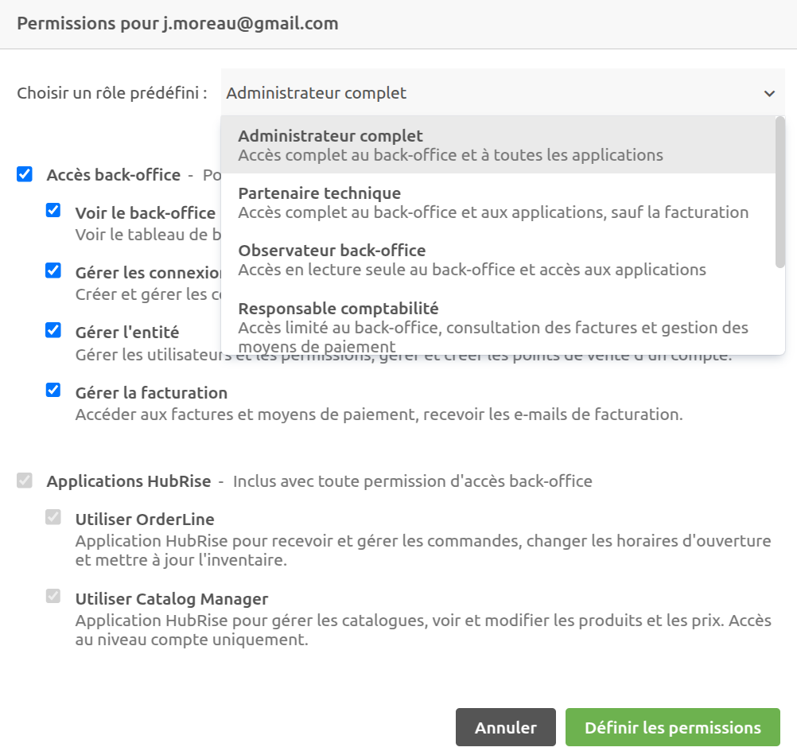

Les permissions permettent de contrôler les actions qu'un utilisateur peut effectuer sur un compte ou un point de vente dans HubRise. Vous pouvez gérer les permissions des utilisateurs dans la section **Permissions** de la page **CONFIGURATION**.

## Rôles et Permissions

HubRise propose une gestion flexible des permissions. Vous pouvez soit attribuer des rôles prédéfinis, soit attribuer manuellement des permissions spécifiques à un utilisateur.

### Rôles prédéfinis

HubRise propose des rôles prédéfinis pour simplifier l’attribution des permissions :

- **Administrateur complet** : Accès à toutes les fonctionnalités, y compris la gestion des utilisateurs, la configuration des connexions et la facturation.
- **Partenaire technique** : Accès à toutes les fonctionnalités, sauf la facturation.
- **Observateur back-office** : Accès en lecture au back-office, et accès à toutes les applications.
- **Responsable comptabilité** : Accès limité au back-office, consultation des factures et gestion des moyens de paiement.
- **Opérateur OrderLine** : Accès restreint à l’application OrderLine.
- **Gestionnaire catalogue** : Accès restreint à l’application Catalog Manager.
- **Rôle personnalisé** : Permet d’attribuer manuellement des permissions spécifiques à un utilisateur.

### Permissions disponibles

Les permissions sont regroupées en deux catégories :

#### Accès Back-Office (accès privilégié)

- **Voir le back-office** : Accéder au tableau de bord, aux connexions et aux données.
- **Gérer les connexions et ressources** : Créer et gérer les connexions, les catalogues et les listes clients.
- **Gérer l'entité** : Gérer les utilisateurs, les permissions et les points de vente.
- **Gérer la facturation** : Accéder aux factures et moyens de paiement.

#### Applications HubRise (accès restreint)

L’accès à certaines applications HubRise peut être accordé individuellement :

- **Utiliser OrderLine** : Application permettant de recevoir et mettre à jour les commandes, modifier les horaires d’ouverture, modifier les disponibilités de produits.
- **Utiliser Catalog Manager** : Application permettant de voir et modifier les catalogues de produits.

Chaque utilisateur ayant un rôle personnalisé peut se voir attribuer une combinaison de permissions respectant les contraintes suivantes :

- **Utiliser Catalog Manager** est uniquement disponible au niveau compte.
- Toute permission back-office donne accès à **Utiliser OrderLine**, et à **Utiliser Catalog Manager** si la permission est attribuée sur un compte.
- **Voir le back-office** est requis pour toute autre permission back-office.

## Ajouter un utilisateur {#add-user}

Les administrateurs peuvent ajouter des utilisateurs et leur attribuer des permissions spécifiques. Si l'utilisateur possède déjà un compte HubRise, il sera immédiatement ajouté. Sinon, il recevra une invitation par e-mail.

### Procédure

1. Accédez à **CONFIGURATION** > **Permissions**.
2. Saisissez l’adresse e-mail de l’utilisateur.
   - Si l’utilisateur existe déjà, son nom s’affichera.
   - Si l’utilisateur n’existe pas encore, il sera invité après sélection des permissions.
3. Sélectionnez les permissions à attribuer.
4. Cliquez sur **Ajouter l'utilisateur**.

## Modifier les permissions d’un utilisateur

1. Dans **CONFIGURATION** > **Permissions**, cliquez sur l’icône de modification 🖉 à côté de l’utilisateur concerné.
2. Sélectionnez un **rôle prédéfini** ou configurez un **rôle personnalisé** en cochant/décochant les permissions disponibles.
3. Cliquez sur **Définir les permissions**.

## Supprimer un utilisateur {#remove-user}

1. Dans **CONFIGURATION** > **Permissions**, cliquez sur l’icône de suppression 🗑️ à côté de l’utilisateur.
2. Confirmez la suppression.

---

**REMARQUE IMPORTANTE** : Un compte ne peut pas être laissé sans administrateur. Avant de supprimer un administrateur, assurez-vous qu’un autre utilisateur dispose des permissions nécessaires.

---
