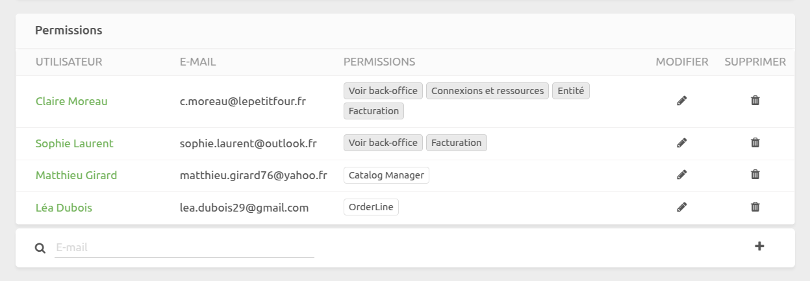
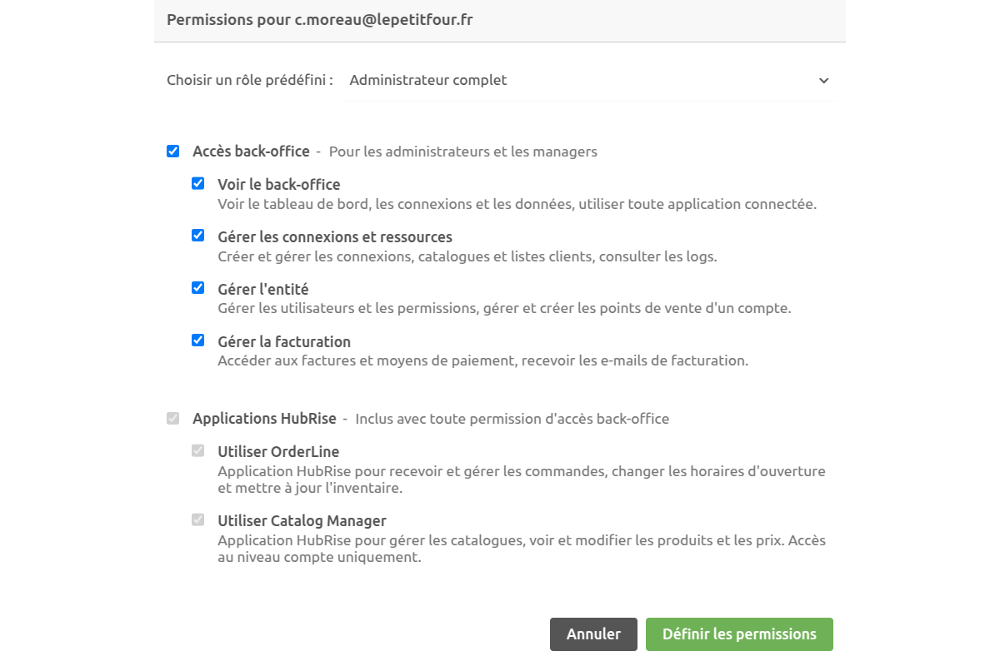
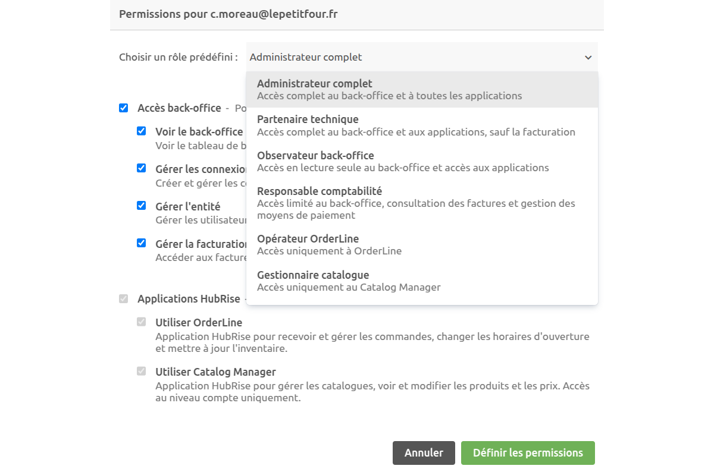
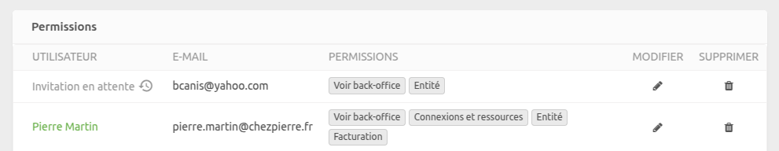
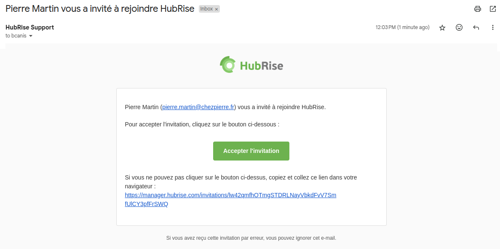
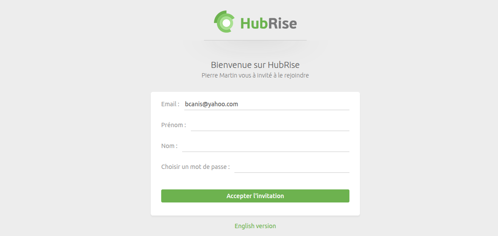

Les permissions permettent de contrôler les actions qu'un utilisateur peut effectuer sur un compte ou un point de vente dans HubRise. Vous pouvez gérer les permissions des utilisateurs dans la section **Permissions** de la page **CONFIGURATION**.

## Rôles et Permissions

HubRise propose une gestion flexible des permissions. Vous pouvez soit attribuer des rôles prédéfinis, soit attribuer manuellement des permissions spécifiques à un utilisateur.

### Permissions disponibles

Les permissions sont regroupées en deux catégories :

#### Accès Back-Office (accès privilégié)

- `Voir le back-office` : Accéder au tableau de bord, aux connexions et aux données.
- `Gérer les connexions et ressources` : Créer et gérer les connexions, les catalogues et les listes clients.
- `Gérer l'entité` : Gérer les utilisateurs, les permissions et les points de vente.
- `Gérer la facturation` : Accéder aux factures et moyens de paiement.

#### Applications HubRise (accès restreint)

L’accès à certaines applications HubRise peut être accordé individuellement :

- `Utiliser OrderLine` : Application permettant de recevoir et mettre à jour les commandes, modifier les horaires d’ouverture, modifier les disponibilités de produits.
- `Utiliser Catalog Manager` : Application permettant de voir et modifier les catalogues de produits.

### Rôles prédéfinis

HubRise propose des rôles prédéfinis pour simplifier l’attribution des permissions :

- **Administrateur complet** : Accès à toutes les fonctionnalités, y compris la gestion des utilisateurs, la configuration des connexions et la facturation.
- **Partenaire technique** : Accès à toutes les fonctionnalités, sauf la facturation.
- **Observateur back-office** : Accès en lecture seule au back-office et à toutes les applications.
- **Responsable comptabilité** : Accès limité au back-office, consultation des factures et gestion des moyens de paiement.
- **Opérateur OrderLine** : Accès restreint à l’application OrderLine.
- **Gestionnaire catalogue** : Accès restreint à l’application Catalog Manager.
- **Rôle personnalisé** : Permet d’attribuer manuellement des permissions spécifiques à un utilisateur.

### Règles d’attribution des permissions

Lorsque vous attribuez des permissions à un compte ou un point de vente, les règles suivantes s’appliquent :

- Au moins un utilisateur doit avoir la permission `Gérer l'entité` sur un compte.
- `Utiliser Catalog Manager` est uniquement disponible au niveau du compte.
- Toute permission back-office donne accès à `Utiliser OrderLine` et, si attribuée au niveau du compte, `Utiliser Catalog Manager`.
- `Voir le back-office` est requis pour toute autre permission back-office.

## Ajouter ou inviter un utilisateur {#add-user}

Les utilisateurs disposant de la permission `Gérer l'entité` peuvent ajouter ou inviter des utilisateurs et leur attribuer des permissions spécifiques.

### Ajouter un utilisateur déjà inscrit

Si l’utilisateur est déjà inscrit sur HubRise :

1. Accédez à **CONFIGURATION** > **Permissions**.
2. Entrez l’adresse e-mail de l’utilisateur à côté de l’icône en forme de loupe. Son nom s’affichera automatiquement.
3. Sélectionnez les permissions à attribuer.
4. Cliquez sur **Ajouter l'utilisateur**.

L’utilisateur sera ajouté immédiatement et apparaîtra dans la liste des permissions avec ses accès attribués. Aucune action supplémentaire n’est requise.

### Inviter un nouvel utilisateur

Si l’utilisateur n’existe pas encore dans HubRise :

1. Accédez à **CONFIGURATION** > **Permissions**.
2. Entrez l’adresse e-mail de l’utilisateur à côté de l’icône en forme de loupe. Le message **Aucun utilisateur trouvé avec cet e-mail** apparaîtra, indiquant que l’utilisateur sera invité.
3. Sélectionnez les permissions à attribuer.
4. Cliquez sur **Ajouter l'utilisateur**.

Après avoir cliqué sur **Ajouter l'utilisateur** :

- L’utilisateur apparaîtra dans la liste des permissions avec un marqueur **Invitation en attente** :
  
- Il recevra un e-mail d’invitation avec un lien pour créer son mot de passe.
  
- L’utilisateur doit cliquer sur le lien de l’e-mail pour définir son mot de passe :
  
- Une fois son mot de passe défini, il pourra accéder à HubRise avec les permissions attribuées.

### Renvoyer une invitation

Si l’utilisateur n’a pas reçu l’e-mail d’invitation ou a perdu le lien, vous pouvez renvoyer l’invitation :

1. Dans **CONFIGURATION** > **Permissions**, cliquez sur l’icône en forme d’horloge à côté du label **Invitation en attente**.
2. Confirmez l’envoi.

## Modifier les permissions d’un utilisateur

1. Dans **CONFIGURATION** > **Permissions**, cliquez sur l’icône en forme de crayon à côté de l’utilisateur, ou cliquez directement sur ses permissions.
2. Sélectionnez un rôle prédéfini ou configurez un rôle personnalisé.
3. Cliquez sur **Définir les permissions**.

---

**REMARQUE IMPORTANTE** : Si vous supprimez votre propre permission `Gérer l'entité`, vous devrez demander à un autre utilisateur disposant de cette permission de vous la réattribuer.

---

## Supprimer un utilisateur {#remove-user}

1. Dans **CONFIGURATION** > **Permissions**, cliquez sur l’icône en forme de corbeille à côté de l’utilisateur.
2. Confirmez la suppression.

Un compte ne peut pas être laissé sans utilisateur disposant de la permission `Gérer l'entité`. Si vous souhaitez supprimer le dernier utilisateur disposant de cette permission, attribuez d'abord cette permission à l'utilisateur test@hubrise.com avant de supprimer l’utilisateur concerné.
