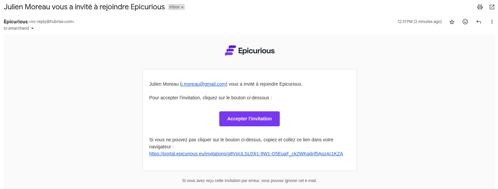
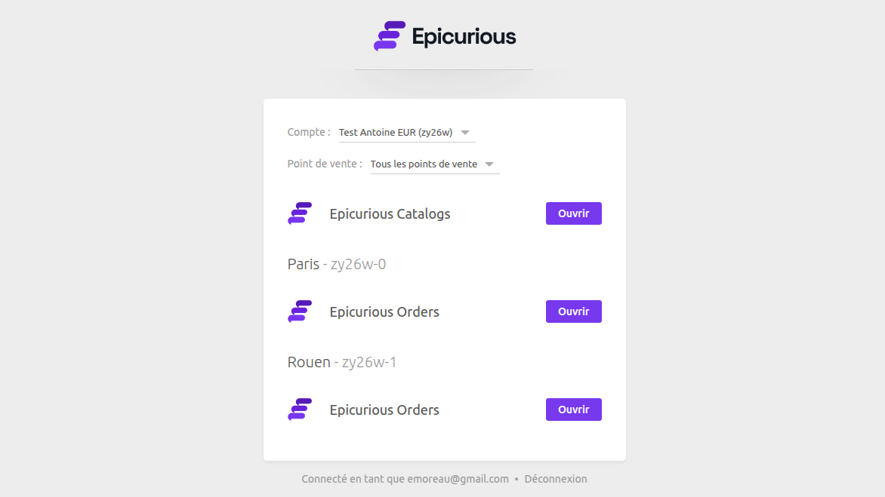

Le programme **HubRise Marque Blanche** permet à certains partenaires de proposer les solutions HubRise sous leur propre marque. Cette offre est destinée aux éditeurs de logiciels, revendeurs et chaînes, à partir d'une dizaine de points de vente.

## Qu'est-ce que HubRise Marque Blanche ?

Avec HubRise Marque Blanche, les partenaires peuvent personnaliser l'apparence de certaines applications HubRise pour les adapter à leur identité visuelle. Les applications concernées sont

- [OrderLine](/apps/orderline/overview) : Une application de prise de commandes pour les points de vente.
- [Catalog Manager](/apps/catalog-manager/overview) : Une application de gestion des catalogues produits.
- Portail Marque Blanche : Une interface de connexion pour les utilisateurs finaux.

Pour chaque application, les éléments suivants sont personnalisables :

- Les couleurs, le nom, le logo et le favicon pour refléter l'identité visuelle du partenaire.
- Le nom de domaine afin de rassurer les utilisateurs finaux.

En revanche, le back office HubRise n'est pas personnalisable. Il reste accessible aux équipes internes du partenaire, qui peuvent ensuite donner accès aux utilisateurs finaux aux applications en marque blanche.

## Mise en place de HubRise Marque Blanche

Pour activer HubRise Marque Blanche, contactez votre responsable partenariat ou écrivez à contact@hubrise.com.

Pour chaque application, les informations suivantes seront demandées :

- Nom de l'application : Le nom affiché sur l'interface, par exemple _Pizza Flamme Commandes_.
- Nom de domaine : Un sous-domaine personnalisé pour l'application, par exemple _commandes.pizza-flamme.com_. Vous devez posséder le domaine principal.
- Couleur principale : La couleur dominante, principalement utilisée pour les boutons et les éléments de navigation. Elle doit offrir un contraste suffisant sur un fond blanc.
- Logo : Une image avec un ratio entre 2:1 et 6:1, au format PNG, JPEG ou WEBP.
- Favicon : Une image de 64x64 px au format PNG.

Votre responsable partenariat pourra vous conseiller pour la personnalisation de vos applications.

### Configuration des sous-domaines

Pour que vos applications soient accessibles sur votre nom de domaine, vous devez configurer un sous-domaine pour chaque application. Cette opération se fait dans l'interface de gestion de votre fournisseur de domaine (ex : OVH, GoDaddy, Gandi, etc.).

Ajoutez une entrée de type `CNAME` pour chaque application, en suivant cet exemple :

```
menus     300 IN CNAME catalog-manager.hubrise-apps.com.
commandes 300 IN CNAME orderline.hubrise-apps.com.
portail   300 IN CNAME manager.hubrise.com.
```

Chaque ligne représente une entrée DNS :

- Le premier champ est le sous-domaine choisi (ex : `menus`).
- Le second champ (`300`) correspond au temps de mise en cache (TTL) en secondes.
- `IN CNAME` indique qu'il s'agit d'un alias pointant vers un autre domaine.
- Le dernier champ est l'adresse cible, qui est fixe et doit être utilisée telle quelle.

Dans cet exemple, si votre domaine est _pizza-flamme.com_, OrderLine sera accessible à l'adresse _commandes.pizza-flamme.com_, et votre Portail Marque Blanche à l'adresse _portail.pizza-flamme.com_.

Une fois les sous-domaines ajoutés, informez votre responsable partenariat. Il se chargera alors de créer des certificats SSL pour chacune de vos applications sous un délai de deux jours ouvrés. Cette opération ne requiert aucune action de votre part.

## Ajout d'un utilisateur

Pour inviter un utilisateur à rejoindre votre environnement Marque Blanche, suivez les étapes indiquées dans la section [Ajouter un utilisateur](/docs/permissions#add-user).

- Si l'utilisateur n'a pas encore de compte HubRise, il recevra un e-mail d'invitation personnalisé avec un lien. Il lui suffira de cliquer sur ce lien pour accepter l'invitation, choisir un mot de passe, et accéder à votre environnement Marque Blanche.



- Sinon, il ne recevra pas d'e-mail, mais pourra utiliser immédiatement ses nouvelles permissions.

## Accès au Portail Marque Blanche

Une fois connecté, l’utilisateur arrive sur le Portail Marque Blanche, une interface sous votre marque qui centralise l’accès aux applications disponibles.



Depuis ce portail, l’utilisateur voit uniquement les applications auxquelles il a accès, et peut les ouvrir en un clic. Ainsi, un utilisateur peut voir :

- Catalog Manager, si la permission **Utiliser Catalog Manager** lui a été attribuée et qu'il a sélectionné un compte.
- OrderLine, si la permission **Utiliser OrderLine** lui a été attribuée.

Les applications apparaissent sous le nom que vous avez choisi, avec votre logo et vos couleurs.

### Tester le Portail Marque Blanche

Pour ouvrir le Portail Marque Blanche et vous rendre compte de l'expérience utilisateur, connectez-vous à votre compte HubRise, ouvrez la page **CONNEXIONS** et cliquez sur **Portail Marque Blanche** en haut à droite.
