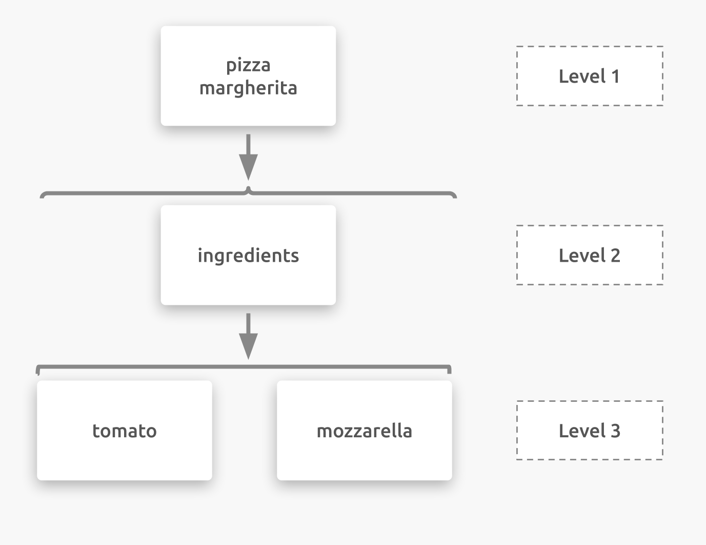

## Key-Value Pairs

JSON is a format that can be used to describe the relation between an object and its features. For example, in the sentence "The pizza is round", “pizza” is the object and “round” is its feature.

In more technical terms, JSON is able to store and transfer structured information using nodes of key-value pairs. Each piece of information is divided into:

- The name or type of information, known as the **key**.
- The content of the information, known as the **value**.

They are separated by a colon, with the key on the left and the value on the right. Consider this very basic JSON:

```json
{
  "pizza": "round"
}
```

In this case, pizza is the key and round its value. Notice the curly brackets in the first and last lines: They indicate the beginning and end of a JSON object.

## Nesting JSON Objects

In the real world, a single object can be related with many features. And each feature can be related to its own features, creating a deep structure of connections.

For example, consider the sentence "The pizza margherita has a size of 12 inches and a price of 8 euros". The main piece of information, or the main key, is “pizza margherita”. It is associated with two features: size and price, each with its own value.

The following diagram illustrates how the information in this example is organised in three different levels.


The main key, "pizza margherita", is attached to a value that is actually a JSON object. Notice the curly bracket above the two keys, “size” and “price”, and their relative values.

The corresponding JSON for this example would be the following.

```json
{
  "pizza margherita": {
    "size": "12 inches",
    "price": "8 EUR"
  }
}
```

In this case, a JSON object is nested inside the main one. You can spot it by looking at the additional curly brackets.

## Lists of Elements

In some cases, a single key can have multiple values. For example, consider the sentence "A pizza margherita has tomato and mozzarella as ingredients". The key “ingredients” is associated with two values at once, “tomato” and “mozzarella”.

The situation is illustrated in the following diagram.



The main node, "pizza margherita", is still linked to a JSON object that has a single key, “ingredients”. This key, in turn, is associated with a _list_ of two values: Notice the square bracket above them in the diagram.

The corresponding JSON for this example would be the following.

```json
{
  "pizza margherita": {
    "ingredients": ["tomato", "mozzarella"]
  }
}
```

The square brackets [] surrounding the values of the list correspond to the bracket used in the diagram.
