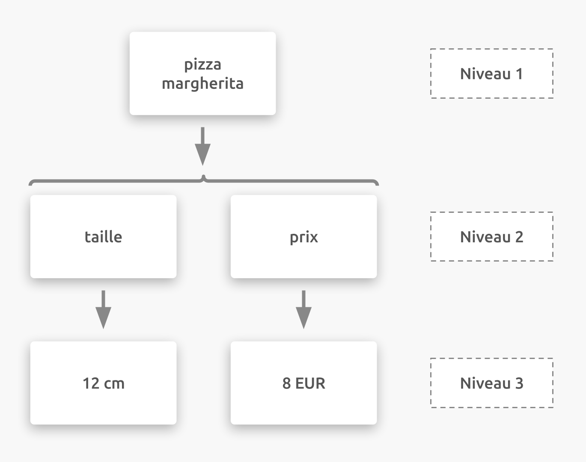
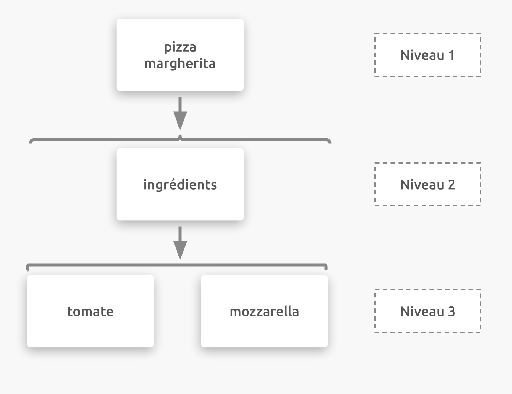

## Paires clé/valeur

Le JSON est un format utilisé pour décrire la relation entre un objet et ses caractéristiques. Par exemple, dans la phrase « La pizza est ronde », le mot « pizza » est l'objet, tandis que « ronde » est l"une de ses caractéristiques.

En des termes plus techniques, JSON est capable de stocker et de transférer des informations structurées en utilisant des nœuds constitués de paires clé/valeur. Chaque information élémentaire se divise en deux parties :

- Le nom ou le type d'information, appelé la **clé**.
- Le contenu de l'information, appelé **valeur**.

Ces deux éléments sont séparés par un signe deux-points, la clé étant placée à gauche et la valeur à droite. Considérons cet exemple JSON très basique :

```json
{
  "pizza": "round"
}
```

Dans le cas présent, « pizza » est la clé et « ronde » sa valeur. Notez la présence de crochets sur la première et la dernière lignes ; leur fonction est d'indiquer le début et la fin d'un objet JSON.

## Imbrication d'objets JSON

Dans le monde réel, un objet unique peut être associé à de nombreuses caractéristiques. Et chaque caractéristique peut être liée aux caractéristiques elles-mêmes de l'objet, créant ainsi une structure arborescente de relations.

Prenons par exemple la phrase : « La pizza margherita a une taille de 30 cm et un prix de 8 euros ». L'information principale, ou la clé principale, est « pizza margherita ». Elle est associée à deux caractéristiques : la taille et le prix, chacune ayant sa propre valeur.

Le schéma suivant illustre la manière dont les informations de cet exemple sont organisées en trois niveaux différents.



La clé principale, « pizza margherita », est rattachée à une valeur qui est en fait un objet JSON. Notons la présence des accolades au-dessus des deux clés « taille » et « prix », et leurs valeurs relatives.

L'objet JSON correspondant à cet exemple serait le suivant.

```json
{
  "pizza margherita": {
    "size": "12 inches",
    "price": "8 EUR"
  }
}
```

Dans ce cas, un objet JSON est imbriqué dans l'objet principal. Sa présence est dénotée par les crochets supplémentaires.

## Listes d'éléments

Dans certains cas, une même clé peut comporter plusieurs valeurs. Prenons par exemple la phrase : « Une pizza margherita a pour ingrédients des tomates et de la mozzarella ». La clé « ingrédients » est ici associée à deux valeurs à la fois  : « tomates » et « mozzarella ».

Cette situation est illustrée dans le diagramme suivant.



Le nœud principal, « pizza margherita », est toujours lié à un objet JSON qui possède une seule clé : « ingrédients ». Cette clé, à son tour, est associée à une _liste_ de deux valeurs ; notez le crochet au-dessus de celles-ci dans le diagramme.

L'objet JSON correspondant à cet exemple serait le suivant.

```json
{
  "pizza margherita": {
    "ingredients": ["tomato", "mozzarella"]
  }
}
```

Les crochets [] qui entourent les valeurs de la liste correspondent au crochet utilisé dans le diagramme.
