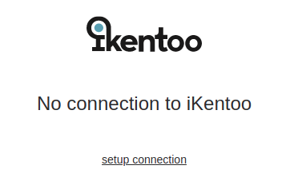
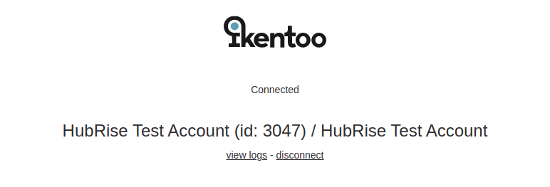

- Open the HubRise apps page: https://manager.hubrise.com/apps

- Find the iKentoo app and connect it   

- When you see the page below, click on "setup connection" and identify yourself with your iKentoo credentials
 

- Select the correct location and click on "Connect"

- That's it, your iKentoo location is connected
 
 